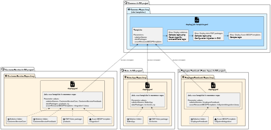

# Scalable enterprise application lifecycle management for Power Platform

**Applies to: Power Apps, Dynamics 365 Customer Service, other Power Platform Services using solutions**

## Scenario

**Overview of ALM Requirements**

ALM is an important concern when building projects on the Power Platform and D365. 

A high-quality ALM process:

- Ensures that teams can reliably deploy the system to test and production environments without introducing unexpected differences or missing components/steps that would cause it to behave differently. This allows them to focus on the change they are making and reducing the risk of breaking other existing working features.

- Tracks what was changed when, by who and why linking changes to the requests from system stakeholders and users. This is it typically done by using source control (for example GitHub or Azure DevOps repos), with changes linked to tickets.

- Includes everything that is needed to make the system work including solutions (potentially several) and other important assets such as key configuration data and associated Azure resources.

Together this ensures that the system remains maintainable and stable long-term as ownership of the system may transcend many different individuals and teams.

**Standard Tools**

The current tools that come with the platform can help us build an ALM system, but don't give us a complete pre-developed setup that we can use:

- The Power Platform solutions system gives us a mechanism to import and export solution aware components, *but it doesn't give us any way to include other assets like base configuration data, or to take any other custom steps during deployment*

- The built-in Power Platform Pipelines feature allows us to manage individual solutions, *but it doesn't include source control integration and custom asset support. (Although it can be extended for simple cases)*

- Power Platform Build Tools for Azure DevOps and GitHub and the Power Apps CLI give us some low level tools to build more complex pipelines, *but require complex orchestration in each pipeline to build complete, stable ALM*.

**Enterprise Challenges**

Enterprise organizations come with additional challenges. 

Often there will be a general policy mandating that teams use standard tools and follow a standard workflow. For example:
-  using GitHub or Azure DevOps for source control together with tickets in Azure Boards or Jira.
-  ensuring all changes are traceable to the ticket to which they relate.
-  standard requirements for review and gated deployment approval
-  deploying required Azure Resources using BICEP templates via pipelines with managed identities.

Each system could develop their own solution to the challenges to ensure they have good complete ALM that meet the corporate policies, but as the organization scales up their use of Power Platform and D365, this becomes inefficient. The current tools require complex extension to meet the needs and policies. Many different processes will emerge, requiring people to learn them and maintain them separately.

**Enterprises ideally need a single ALM process with as much implementation shared as possible.**

## Architecture

This archtecture demonstrates a scalable enterprise-compliant architecture for ALM using the standard Microsoft Tools.

> **Notes**
>
> This example presents the architecture using Azure DevOps concepts and terminology. A similar pattern is possible with GitHub
> 
> A deployment process is shown here, but the same patterns can be applied to other process steps.

The following diagram illustrates how multiple AzDO project and repositories can consume shared pipeline templates from a common repository.

The template contains all the logic and complex steps required to achieve a stable process

> This simplified example shows illustrates the capability to deploy zero to many solutions and zero to many associated Azure resource templates (using the standard BICEP). This illustrates the concept and can be extended to handle other required assets and steps.

Each consuming repo simply defined stub pipelines that point at the template and provide the parameters that specify which assets should be processed.

The complex logic can therefore be maintained centrally and is not repeated for every project. Teams can follow a standardised lifecycle process.

<!-- PlantUML diagram source has also been included -->

### Alternatives

Power Platform Pipelines offers several extension mechanism that can be used to add the logic needed to comply with enterprise standard and polcies:

- [Extend pipelines using business events](https://learn.microsoft.com/en-us/power-platform/alm/extend-pipelines)
- [Extend pipelines using GitHub Actions](https://learn.microsoft.com/en-us/power-platform/alm/extend-pipelines-github-export)

An alternative archtecture would be needed to put those customisation in place and keep them up to date across many consuming system.

## Next steps

[Azure Devops Documentation - Use YAML templates in pipelines for reusable and secure processes](https://learn.microsoft.com/en-us/azure/devops/pipelines/process/templates?view=azure-devops&pivots=templates-includes)
[GitHub Actions - Reuse Workflows](https://docs.github.com/en/actions/how-tos/reuse-automations/reuse-workflows)