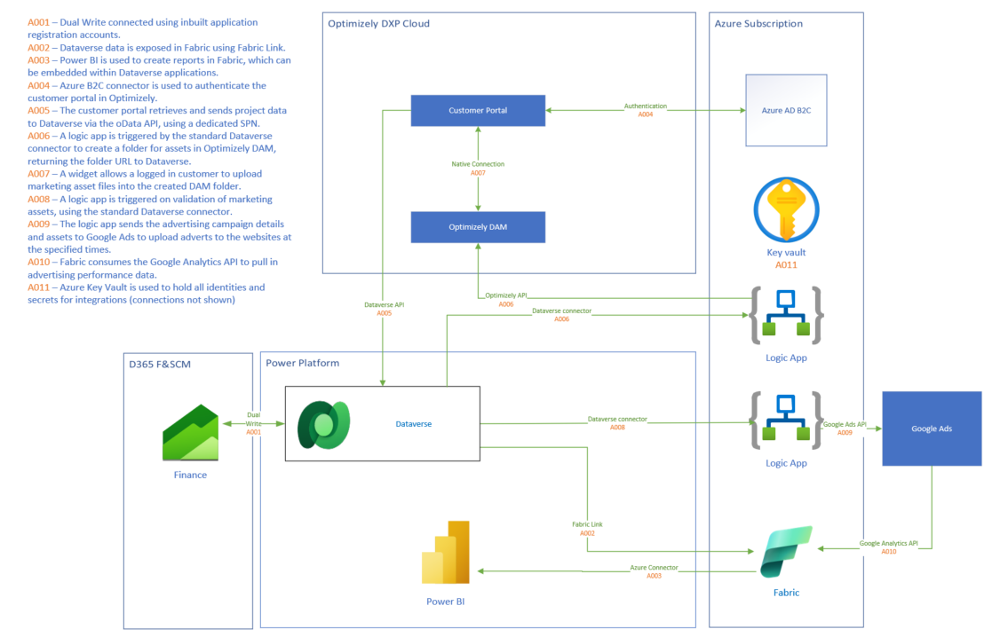
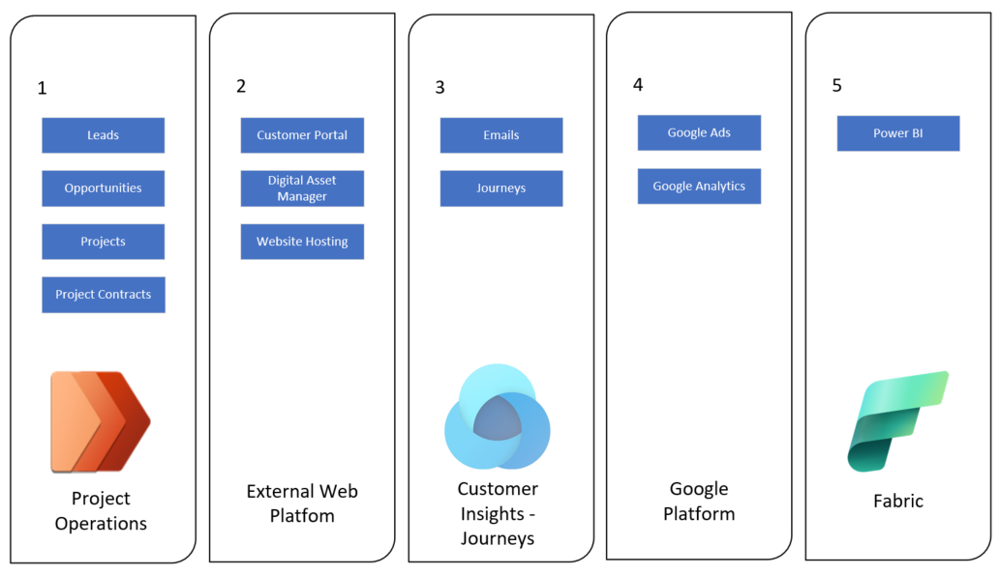

# Digital Advertising from Dynamics 365

***Applies to: Dynamics 365 Project Operations, Dynamics 365 Customer Insights, Dynamics 365 Finance***

This solution uses Project Operations to manage digital advertising campaigns and book out the available advertising space using Universal Resource Scheduling. Email adverts are delivered within newsletters sent from Customer Insights - Journeys, online adverts are booked via an integration with Google Ads, and Fabric is used to create combined performance reporting.

## Architecture

### Application Architecture

Download a [Visio file](https://github.com/microsoft/dynamics365patternspractices/submit-architecture\digital-advertising-from-dynamics\Digital-Advertising-Architecture_Simplified.vsdx) with this architecture.

### Functional Architecture

### Dataflow

1. A salesperson sets up a project in Project Operations, detailing the activity needed to drive a digital marketing campaign. The salesperson also creates the project contract and uses the resource scheduling to book equipment resources, which represent the areas on a website or in a newsletter email where an advert will be placed.
2. Once the contract has been signed, the project is made available in a customer portal where the customer can upload their marketing assets. The assets uploaded in the portal are stored in a Digital Asset Management solution, where they can be used as content in websites or emails. The public URL of each asset is passed back into the project.
3. A marketing person uses the public URL of an asset to include it as content within an email newsletter in Customer Insights - Journeys.
4. The marketing assets are uploaded to Google Ads, which allows them to be displayed on websites, and Google Analytics is used to collect performance data.
5. The data from Google Analytics and Customer Insights - Journeys is consumed within Microsoft Fabric to produce reports on campaign and advertising performance.

### Components

- [Dynamics 365 Project Operations](https://learn.microsoft.com/dynamics365/project-operations) manages the sales, organisation and billing of digital advertising campaigns
- [Dynamics 365 Customer Insights - Journeys](https://learn.microsoft.com/dynamics365/customer-insights/journeys) manages the distribution of digital adverts via email
- [Dynamics 365 Finance](https://learn.microsoft.com/dynamics365/finance) manages invoicing and payments
- [Microsoft Entra ID](https://learn.microsoft.com/entra) manages internal user identities and SPNs for integrations
- [Azure B2C](https://learn.microsoft.com/azure/active-directory-b2c) manages customer identities for the portal
- [Azure Key Vault](https://learn.microsoft.com/azure/key-vault) manages secrets and keys for authenticating integrations
- [Azure Logic Apps](https://learn.microsoft.com/azure/logic-apps) manage the integration logic between Dynamics 365 and other systems
- Optimizely hosts the customer portal and Digital Asset Manager
- [Microsoft Fabric](https://learn.microsoft.com/fabric) manages reporting
- Google Ads displays digital adverts on webpages

### Alternatives

The following alternatives were considered:  

- The customer portal can be configured in [Power Pages](https://learn.microsoft.com/power-pages). For our implementation, Optimizely CMS was already in use and had a readily accessible Digital Asset Manager.
- The Digital Asset Manager could be replaced with [Azure Blob Storage](https://learn.microsoft.com/azure/storage/blobs) if using Power Pages for a customer portal. This would require a more complex integration to be built but would also reduce overall licensing costs.
- Project Operations is best suited for large and complex advertising campaigns. For a system where clients can self-serve or where clients consistently purchase a single advertising block at a time, it may be best to use a custom table for advertising campaigns in Dataverse and use the standard sales order functionality for billing. Universal Resource Scheduling is a key part of this process so at least one custom table would need to be enabled for bookings.
- For complex integrations to target systems, [Azure Functions](https://learn.microsoft.com/azure/azure-functions) may be required.
- The customer portal may be removed from the design if assets are created in house or if clients can deliver assets via email. This would reduce the costs of implementation and external licensing.

## Scenario details

This reference architecture may apply for a digital or traditional advertising company, where marketing campaigns include many dependent activities that are difficult to manage. The company can organise marketing campaigns as projects and ensure more reliable delivery for clients. It is also necessary to track online inventory to ensure that there are always adverts running on the company's websites and in newsletters. Using this architecture, the company can see what inventory is unsold for the following quarter and introduce promotions or targeted selling to make the most of their advertising platforms.

### Potential use cases

This solution was created for a B2B digital advertising organisation looking to consolidate disparate systems used to manage different parts of the marketing campaign process. It can be applied directly for digital advertising companies. In general, Project Operations in a similar architecture can be used to organise re-usable inventory as resources. This fits well into other media and entertainment verticals, such as television and film distribution.

## Considerations

These considerations help implement a solution that includes Dynamics 365 and reflects on the Success by Design framework and the Well-Architected Framework (WAF) pillars. Learn more at [Dynamics 365 guidance documentation](https://learn.microsoft.com/dynamics365/guidance/).

### Environment strategy

Environments are containers that store, manage, and share your organization's data. They also store the data model, application metadata, process definitions, and the security constructs to control access to data and apps. Learn more at [Environment strategy](https://learn.microsoft.com/dynamics365/fasttrack/implementation-guide/environment-strategy).

Using dual-write, it is recommended that all D365 Finance and Dataverse environments are maintained in a 1:1 ratio, e.g. a Finance UAT environment links to a Dataverse UAT environment. No environments should be standalone Finance or standalone Dataverse because the necessary solutions for dual write will be missing.
It is also highly recommended that the portal and target systems follow the same environment pattern as Dynamics 365 test and production environments. Not having a test environment for a target system and using stub integrations would make it very difficult to run end to end tests and validate reporting design.

### Performance efficiency

Performance and early prioritization are directly related to the success of a project. Learn more at [A performing solution, beyond infrastructure](https://learn.microsoft.com/dynamics365/fasttrack/implementation-guide/performing-solution).

Project Operations uses a different API from the standard Dataverse API. Consider the [API limits]() when building any automation on top of Project Operations.
These APIs run the complex data updates asynchronously so this needs to be considered from a performance perspective and not have any synchronous processes waiting for these updates.

### Security

Security provides assurances against deliberate attacks and the abuse of your valuable data and systems. Learn more at [Overview of the security pillar](https://learn.microsoft.com/azure/architecture/framework/security/overview) and [Security in Dynamics 365 implementations](https://learn.microsoft.com/dynamics365/fasttrack/implementation-guide/security).

The customer portal should be secured with Azure B2C or equivalent identity management. Local authentication is not secure enough for the data that is exposed in this portal.
The integration identity for the portal connection to Dataverse should have minimal permissions to reduce the risk of attack via the portal.
This solution was implemented with Azure Bastion and Virtual Networks to secure the Azure subscription. It is important to design the security of your Azure setup but this has been left out of this architecture, as it could vary considerably between implementations.

### Cost optimization

Cost optimization is about looking at ways to reduce unnecessary expenses and improve operational efficiencies. Learn more at [Overview of the cost optimization pillar](https://learn.microsoft.com/azure/architecture/framework/cost/overview).

The running cost is equivalent to a standard Dynamics 365 project including Project Operations, Finance and Marketing plus the cost of the Logic Apps for integration to the external portal and target advertising platforms. 
Transaction volumes for the logic apps are expected to be low enough that consumption based Logic Apps are more cost effective than standard. 
Assets are deliberately kept within the Digital Asset Manager with links provided to those assets in Customer Insights - Journeys, to reduce the impact on Dataverse file capacity over time.

## Contributors

*This article is maintained by Microsoft. It was originally written by the following contributors.*

**Principal authors:**

- [Dan Bailey](https://www.linkedin.com/in/danielbailey121/) | Solution Architect
