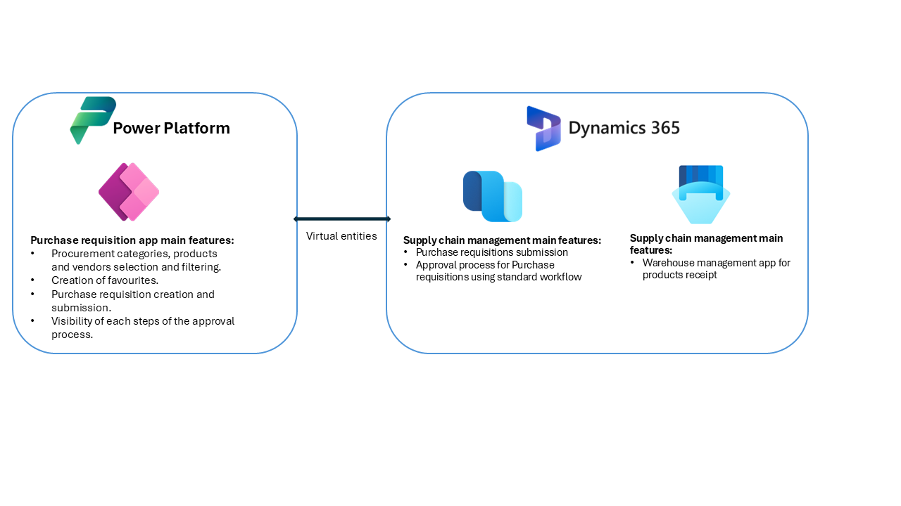
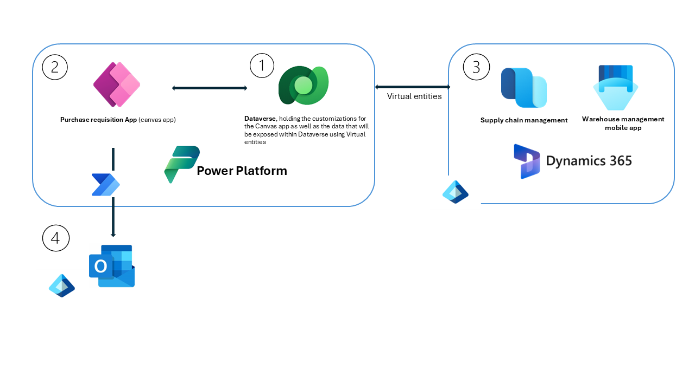

title: Dynamics 365 and Power Apps for Simplified Procurement (Source to Pay Process Component)
description: This solution combines Dynamics 365 Supply Chain Management, Power Automate, Power Apps, and Dataverse to build a solution that streamlines the procurement process, spanning from the creation of purchase requisitions to goods receipting.
keywords: Dynamics 365 Supply Chain Management, Power Automate, Power Apps, Dataverse, Procurement, Source to Pay
ms.service: dynamics-365
ms.subservice: guidance
ms.topic: conceptual
ms.custom: bap-template
author: [CRHISTELLEMICHEL]
ms.date: 02/27/2025
---

# Dynamics 365 and Power Apps for Simplified Procurement (Source to Pay Process Component)

***Applies to: Dynamics 365 Supply Chain Management, Power Automate, Power Apps, Dataverse, Azure Active Directory***

This solution combines Dynamics 365 Supply Chain Management, Power Automate, Power Apps, and Dataverse to build a solution that streamlines the procurement process, spanning from the creation of purchase requisitions to goods receipting. By leveraging user-friendly features and automation, it ensures that only essential Dynamics 365 data and functions are accessible to users. This approach provides a customized user experience while reducing complexity for non-power users. Shop floor workers will be able to create requisitions as soon as the need arises, replacing the practice of writing requests for later submission when in front of a computer, and therefore accelerating business processes.

## Introduction

A user-friendly app is built using Power Apps, allowing non-power users to create and submit purchase requisitions to Dynamics 365 Supply Chain Management. Necessary Dynamics D365 data is exposed within Dataverse through virtual entities. Odata action is utilized to automatically submit the purchase requisitions for approval in D365 Supply Chain Management. Requesters can track the approval process via the app. Once the purchase requisitions are approved, standard processes within D365 Supply Chain Management are used to generate and confirm purchase orders. Confirmed purchase orders are received using the standard Warehouse mobile app.

This solution is applicable across various industries where a simplified straightforward method is needed to submit procurement requests and receive goods. This reference architecture should be defined in the explore phase of the project implementation but can also be applied at a later stage if a Dynamics 365 Supply Chain Management solution is already established.

The key stakeholders involved in this solution architecture include representatives from Procurement, Warehousing, Accounts Payable, and IT departments.

## Architecture

The following diagram illustrates the functional and application architecture for the solution.

[Download a PowerPoint](dynamics-365-and-power-apps-for-simplified-procurement-reference-architecture.pptx) file with this architecture.

## Dataflow

1.	Dynamics 365 Supply Chain Management data will be exposed within Dataverse using virtual entities. 
2.	The user will use the app built using Canvas app to create Purchase requisitions. The app will read and write data to Dynamics 365 via the Dataverse tables configured as virtual entities. Data access is controlled through the security settings in D365 Supply Chain Management.
3.	Dynamics 365 users will review the purchase requisitions created in D365 Supply Chain Management. Once approved, purchase orders will be automatically generated and confirmed using standard processes. Confirmed purchase orders will be available for receipt using the Warehouse mobile app.
4.	Outlook/Exchange will be used for the automated sending of email confirmations from the application. 

## Components

The following components are used in the reference architecture:

- **Power Apps (Canvas app)** is utilized to build a user-friendly application for creating Purchase requisitions.
- **Dataverse** serves as the source of data for this process. Finance and operations apps are a virtual data source in Dataverse and enable full CRUD operations (user security permitting) from Dataverse and Microsoft Power Platform.
- **Dynamics 365 Supply Chain Management** provides functionalities for processing purchase requisitions.
- **Dynamics 365 Warehouse mobile app** enables users to efficiently receive products.
- **Power Automate** provides automation for sending Emails to suppliers and calls the Odata action to submit to workflow.
- **Microsoft Outlook** Facilitates business communication.
- **Microsoft Entra ID** Manages internal user identities.

## Scenario Details

This solution was introduced to an animal healthcare organization with multiple branches to optimize their Source to Pay process. Branch users will be able to create requisitions as soon as needs arise, removing the need to write and submit requests later from their computers, ensuring that no essential requests are missed. Branch users can receive goods immediately upon arrival, eliminating the need to return to their desks. This solution enhances visibility for the head office overseeing the branches, as all requests can be centrally approved and receipting is done as soon as the goods arrive, providing the Accounts Payable team with complete oversight of purchases.

### Potential Use Cases

This solution is versatile and applicable across various industries that require a simple yet controlled Source to Pay process. This makes it particularly beneficial for:

- **Cleaning Agents** who need to quickly refill their supplies to continue their work efficiently. The app enables them to generate purchase requisitions for cleaning supplies on the go, ensuring they have the necessary materials available.
- **School Staff** who need to ensure that essential materials are available for teaching and school operations. This app allows them to easily create purchase requisitions for educational materials, office supplies, and other necessities. 
- **Construction Site Managers - Project supervisors** who need to request materials like cement, nails, or safety gear directly from the site. The app ensures materials are ordered on time, preventing work delays.
- **Veterinarians on Mobile Clinics** – Veterinarians working in rural areas or livestock farms who need to request medications, vaccines, or diagnostic tools while on the move. The app helps them keep inventory levels up without returning to a central office.

The app is designed for simplicity and ease of use, displaying only essential information to streamline purchase requisitions and minimize the learning curve for users. A key feature is its integration with the centralized approval workflow (in D365 Supply Chain Management), ensuring that every request is necessary and properly authorized before proceeding. Once approved, the reception of the products is handled directly by branches, guaranteeing timely availability without unnecessary delays. This structured approach enhances cost control and oversight while keeping the process straightforward for non-power users. By offering a simplified Purchase request origination, it enables a real-time pull process, eliminates inefficiencies and ultimately improving operational efficiency as it ensures supplies and materials are available at the right time.

## Considerations

These considerations help implement a solution that includes Dynamics 365. Learn more at [Dynamics 365 guidance documentation](https://learn.microsoft.com/dynamics365/guidance/).

### Cost Optimization

Cost optimization is about looking at ways to reduce unnecessary expenses and improve operational efficiencies. For more information, see [Overview of the cost optimization pillar](https://learn.microsoft.com/azure/architecture/framework/cost/overview).

#### Licensing Cost (evaluation on 21/02/2024):

- A Power Platform license with the ability to access premium connectors and Dataverse, as well as a Dynamics 365 license that allows users to create purchase requisition (team member license) 
- A Dynamics 365 license that allows access to the warehouse management app for goods receipt

## Related Resources

You can use the following resources to learn more about the components of the solution:

- [Power Apps Canvas Apps Documentation](https://learn.microsoft.com/powerapps/maker/canvas-apps/)
- [Microsoft Dataverse Documentation](https://learn.microsoft.com/powerapps/maker/data-platform/)
- [Virtual Entities Overview](https://learn.microsoft.com/dynamics365/guidance/virtual-entities)
- [Microsoft Dynamics 365 Supply Chain Management Documentation](https://learn.microsoft.com/dynamics365/supply-chain/)
- [Install the Warehouse Management Mobile App](https://learn.microsoft.com/dynamics365/supply-chain/warehousing/warehousing-mobile-application)

## Contributors

This article is maintained by Microsoft. It was originally written by the following contributors:

**Principal Author:**
- [Christelle Michel] | Solution Architect
