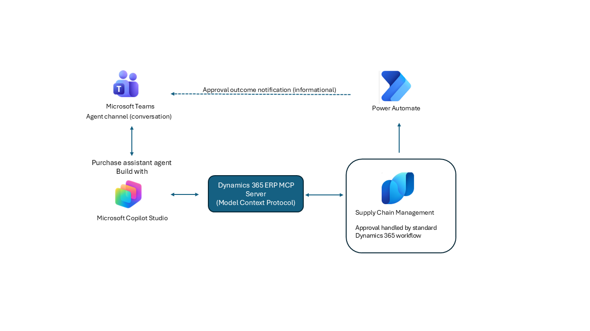

title: Purchase Requisition agent with Copilot Studio and Dynamics 365 ERP MCP
description: This solution combines Microsoft Copilot Studio, Dynamics 365 Supply Chain Management, Microsoft Teams and Power Automate to enable business users to create and submit Purchase Requisitions conversationally
keywords: Dynamics 365 Supply Chain Management, Power Automate, Microsoft Copilot Studio, Procurement, Source to Pay
ms.service: dynamics-365
ms.subservice: guidance
ms.topic: conceptual
ms.custom: bap-template
author: [MICHELCHRISTELLE]
ms.date: 02/27/2026
---

# Purchase Requisition agent with Copilot Studio and Dynamics 365 ERP MCP

***Applies to: Dynamics 365 Supply Chain Management, Power automate, Microsoft Entra ID, Microsoft Copilot Studio***

This solution combines Microsoft Copilot Studio, Dynamics 365 Supply Chain Management, Microsoft Teams and Power Automate to enable business users to create and submit Purchase Requisitions conversationally. Using the Dynamics 365 ERP Model Context Protocol (MCP), the agent orchestrates data collection, validates policy critical fields, and creates the purchase requisition in Dynamics 365 Supply Chain Management under the user’s identity. Approvals are handled by standard Dynamics 365 workflow, while Power Automate is used solely to relay approval status updates back to Microsoft Teams as informational notifications.

## Introduction

This reference architecture illustrates how business users can initiate and submit purchase requisitions using a Microsoft Copilot Studio agent integrated with Dynamics 365 Supply Chain Management through the Dynamics 365 ERP Model Context Protocol (MCP). The solution is particularly well suited for organizations with decentralized requesters and centralized procurement functions, helping reduce ERP training effort while improving adherence to procurement policies.

The architecture is typically defined during the Explore phase of an implementation but can also be applied in later phases where Dynamics 365 Supply Chain Management is already deployed.

Key stakeholders involved in this solution include representatives from Procurement (process ownership), Accounts Payable (policies and financial controls), IT (identity and environments), and Security and Compliance teams.

## Architecture

The following diagram illustrates the functional and application architecture for the solution.

[Download a PowerPoint](purchase-requisition-agent-with-copilot-studio-and-dynamics-365-erp-mcp-reference-architecture.pptx) file with this architecture.

The diagram illustrates how users access conversational channels such as Microsoft Teams to engage with a Microsoft Copilot Studio agent. The agent interacts with Dynamics 365 Supply Chain Management through the Dynamics 365 ERP MCP to create purchase requisition headers and lines and submit them to the standard Dynamics 365 Supply Chain Management approval workflow. Approval processing is handled natively within Dynamics 365 Supply Chain Management, while Power Automate sends informational approval status notifications to Microsoft Teams. Identity and user consent are managed through Microsoft Entra ID.

## Dataflow

1.	User initiates a request to create a purchase requisition using natural language in Microsoft Teams.
2.	Microsoft Copilot Studio agent interprets the intent and guides the user through the requisition creation process, ensuring all required information is collected and validated. 
3.	The agent presents a confirmation step, summarizing the intended action and requesting explicit user approval before proceeding.
4.	Upon confirmation, the agent invokes Dynamics 365 Supply Chain Management via Dynamics 365 ERP MCP to create and submit the purchase requisition under the user’s delegated identity, applying standard business rules and security.
5.	The purchase requisition is submitted to the standard approval workflow in Dynamics 365 Supply Chain Management, where approvers are notified through existing mechanisms.
6.	The agent returns the outcome to the user, including the purchase requisition reference, current status, and a deep link to Dynamics 365 Supply Chain Management.
7.	As the approval workflow progresses or completes, Power Automate sends informational approval status updates to Microsoft Teams to keep the user informed.

## Components

The following components are used in the reference architecture:

- **[Dynamics 365 Supply Chain Management](https://learn.microsoft.com/dynamics365/supply-chain/inventory/quality-management-processes)** is the system of record for purchase requisitions and enforces procurement categories, policies, and approval workflows.
- **[Microsoft Copilot Studio](https://learn.microsoft.com/microsoft-copilot-studio/)** is used to build the conversational agent and to securely invoke Dynamics 365 ERP MCP for delegated operations.
- **[Dynamics 365 ERP MCP](https://learn.microsoft.com/dynamics365/fin-ops-core/dev-itpro/copilot/copilot-mcp)** provides a dynamic framework for agents to perform data operations and access the business logic of Dynamics 365 Supply Chain Management app, without requiring customers to build or maintain custom APIs, connectors, or middleware
- **[Microsoft Teams](https://learn.microsoft.com/microsoftteams/)** is used as the primary end user conversational channel for initiating and confirming purchase requisition creation.
- **Microsoft Entra ID** (formerly Azure AD) serves as the identity and access control plane across the agent, user channel, and ERP by authenticating users, issuing tokens, enforcing access controls, and ensuring that all actions executed through MCP run under the user’s delegated identity with Dynamics 365 Supply Chain Management role based permissions.
- **[Power Automate](https://learn.microsoft.com/power-automate/)** is used to send informational purchase requisition status notifications from Dynamics 365 Supply Chain Management to Microsoft Teams.

## Scenario Details

This scenario enables business users to create and submit purchase requisitions through a conversational Copilot Studio agent in Microsoft Teams, reducing reliance on direct ERP interaction. The agent guides users to provide required requisition data, validates policy critical fields such as legal entity, procurement category, vendor, and financial dimensions, and requires explicit confirmation before submission. Upon confirmation, the agent uses Dynamics 365 ERP MCP to create and submit the purchase requisition in Dynamics 365 Supply Chain Management under the user’s delegated identity, ensuring that standard business rules, security roles, and approval workflows are enforced. This approach improves efficiency and compliance while minimizing training requirements for occasional requisitioners.

This architecture is not intended to replace full procurement functionality in Dynamics 365 Supply Chain Management for professional buyers or complex sourcing scenarios. Users who require advanced purchasing features should continue to use the native application.

### Potential Use Cases

This scenario applies to organizations with decentralized requesters and centralized procurement functions, particularly in multi entity environments that require strong policy enforcement and auditable approvals. It supports both catalog and non catalog purchasing, including services, urgent requests, and cross company requisitions.

The solution is applicable across industries such as construction, retail, healthcare, education, professional services, and the public sector, where users need a simple, self service way to initiate procurement without bypassing governance. By combining conversational intake with Dynamics 365 policy enforcement and approval workflows, the solution enables self service procurement while maintaining financial control and consistency across the organization.

You can use this solution to: 
- Reduce purchase requisition cycle times by helping requesters submit complete requests upfront, minimizing rework and follow up between requesters and procurement teams.
- Strengthen procurement governance by ensuring only policy compliant requisitions enter the approval workflow, reducing exceptions and manual intervention.
- Enhance the requester experience by providing contextual guidance during requisition creation, such as suggesting commonly used vendors for a selected procurement category or presenting available categories to choose from, capabilities that go beyond a standard, form based purchase requisition.

## Considerations

These considerations help implement a solution that includes Dynamics 365. Learn more at [Dynamics 365 guidance documentation](https://learn.microsoft.com/dynamics365/guidance/).

All actions executed through Dynamics 365 ERP MCP run under the user’s Microsoft Entra ID identity and Dynamics 365 role based security, with user or administrator consent granted per tenant policy, ensuring that the agent cannot perform actions the user is not authorized to perform. Management business logic, validations, and workflows are enforced and cannot be bypassed, including procurement policies, financial controls, or approval rules.
The solution follows standard environment isolation and application lifecycle management (ALM) practices, with separate development, test, and production environments for both Copilot Studio and Dynamics 365. MCP is enabled per environment, and agent configuration is promoted using Power Platform solutions and ALM tooling. All activities are auditable through standard platform logging: purchase requisition creation and approvals through Dynamics 365 Supply Chain Management workflow framework, authentication and consent events are recorded in Microsoft Entra sign in and audit logs, and Copilot Studio and Power Automate provide run history and operational telemetry for conversations and notifications.

### Cost Optimization

Cost optimization is about looking at ways to reduce unnecessary expenses and improve operational efficiencies. For more information, see [Overview of the cost optimization pillar](https://learn.microsoft.com/azure/architecture/framework/cost/overview).

- Dynamics 365 license required for users who create and submit purchase requisitions. Dynamics 365 ERP MCP does not currently require additional licensing beyond the user’s existing Dynamics 365 entitlement, provided actions remain within supported scenarios and the user is properly licensed. All actions run under the user’s existing D365 license and role in accordance with Dynamics 365 licensing terms.
- Microsoft Copilot Studio license required to build, publish, and run the conversational agent. Costs are based on Copilot Studio capacity and conversational usage.
- Microsoft Teams is used as the end user conversational channel. Teams is typically included in Microsoft 365 enterprise subscriptions and therefore does not usually introduce incremental licensing costs.
- Power Automate usage is limited to approval status notifications triggered by Dynamics 365 Supply Chain Management and implemented using standard connectors. This usage is typically covered by existing Dynamics 365 license entitlements, provided execution volumes remain within included limits.

## Implementing purchase requisition agent with Copilot Studio and Dynamics 365 ERP MCP
This implementation assumes a Dynamics 365 Supply Chain Management instance already exists with the data required for purchase requisition creation ([Purchase requisition overview](https://learn.microsoft.com/dynamics365/supply-chain/procurement/purchase-requisitions-overview)). The focus is on configuring a Microsoft Copilot Studio agent with Dynamics 365 ERP MCP and deploying it to Microsoft Teams. Power Automate is used only for informational notifications.
1.	Pre-requisites: a Dynamics 365 Supply Chain Management environment that meets the minimum requirements for the Dynamics 365 ERP MCP, including supported application versions, MCP enabled, the agent platform approved in [Allowed MCP Clients](https://learn.microsoft.com/dynamics365/fin-ops-core/dev-itpro/copilot/copilot-mcp#allowed-mcp-clients), and a supported environment tier (Tier 2 or Unified Developer Environment).
For the complete and up to date list of prerequisites and configuration steps, see [Use Model Context Protocol for finance and operations apps](https://learn.microsoft.com/dynamics365/fin-ops-core/dev-itpro/copilot/copilot-mcp) on Microsoft Learn.
2.	Create the purchase requisition agent in Copilot Studio within the environment associated with the target Dynamics 365 Supply Chain Management instance. Author instructions to collect required data, validate policy critical fields, require explicit confirmation, and invoke MCP. More information can be found in this article [Write agent instructions](https://learn.microsoft.com/microsoft-copilot-studio/authoring-instructions).
3.	Attach the Dynamics 365 ERP MCP tool to the agent and configure the connection so the agent can create and submit purchase requisitions under the user’s delegated identity.
4.	Publish the agent after validating conversational flows, policy checks, and MCP operations (create header/lines and submit to standard workflow).
5.	Deploy the agent to the Microsoft Teams channel. More information can be found in this article [Connect and configure an Agent for Teams and Microsoft 365](https://learn.microsoft.com/microsoft-copilot-studio/publication-add-bot-to-microsoft-teams).
6.	Create Power Automate flows to send purchase requisition status change notifications from Dynamics 365 Supply Chain Management to Microsoft Teams using standard connectors.

## Next step
//

## Related patterns
// 

## Related Resources

You can use the following resources to learn more about the components of the solution:

- [Power Apps Canvas Apps Documentation](https://learn.microsoft.com/powerapps/maker/canvas-apps/)
- [Microsoft Dataverse Documentation](https://learn.microsoft.com/powerapps/maker/data-platform/)
- [Virtual Entities Overview](https://learn.microsoft.com/dynamics365/guidance/virtual-entities)
- [Microsoft Dynamics 365 Supply Chain Management Documentation](https://learn.microsoft.com/dynamics365/supply-chain/)
- [Install the Warehouse Management Mobile App](https://learn.microsoft.com/dynamics365/supply-chain/warehousing/warehousing-mobile-application)

## Contributors

This article is maintained by Microsoft. It was originally written by the following contributors:

**Principal Author:**
- [Christelle Michel](http://www.linkedin.com/in/christelle-michel) | Solution Architect
