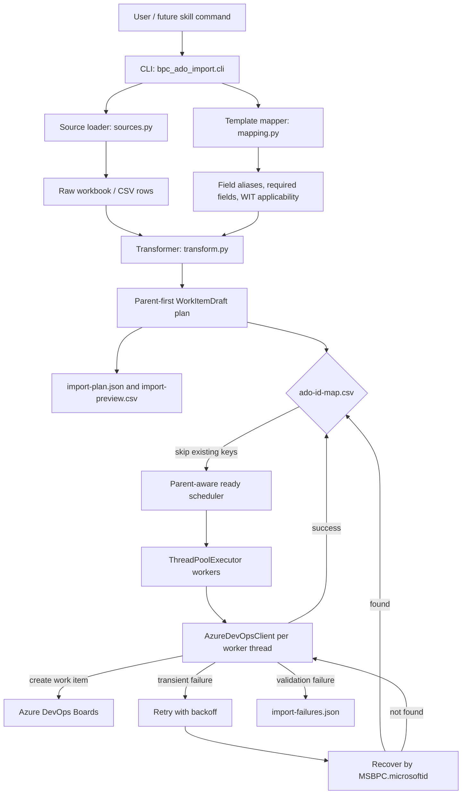

# BPC ADO importer architecture

The June Preview importer is a single-process, resumable Azure DevOps import utility. It keeps hierarchy creation deterministic by creating parents before children, and it keeps reruns idempotent through the `ado-id-map.csv` file.



## Main components

| Component | File | Responsibility |
| --- | --- | --- |
| CLI orchestration | `bpc_ado_import/cli.py` | Parses commands, coordinates plan/import, writes output files, shows progress |
| Source loading | `bpc_ado_import/sources.py` | Reads `.xlsx`, `.xlsm`, `.csv`, `.tsv`; handles two-row workbook headers |
| Template mapping | `bpc_ado_import/mapping.py` | Loads `Fields` and `Work item types` sheets; maps friendly source headers to ADO reference names |
| Transformation | `bpc_ado_import/transform.py` | Builds parent-first work item drafts, normalizes values, derives hierarchy keys |
| Test steps | `bpc_ado_import/test_steps.py` | Converts plain text steps into ADO Test Case step XML |
| ADO API client | `bpc_ado_import/ado.py` | Calls Azure DevOps REST APIs, creates work items, retries transient errors |

## Idempotency model

The importer uses the source key, usually `MSBPC.microsoftid` or process sequence ID, as the stable import key. The importer scopes output by Azure DevOps organization/project and appends each successful create to:

```text
out\<organization>_<project>\ado-id-map.csv
```

On rerun, keys already present in that project-specific `ado-id-map.csv` are skipped. For ambiguous transient create failures, the importer also queries ADO by `MSBPC.microsoftid` before retrying, reducing duplicate risk when ADO created the item but the HTTP response was lost.

## Retry model

The importer retries:

- connection resets,
- timeouts,
- HTTP 408,
- HTTP 429,
- HTTP 5xx.

Defaults:

```powershell
--max-retries 3
--retry-delay-seconds 5
--recovery-field MSBPC.microsoftid
```

Validation errors, such as invalid picklist values or required-field failures, are not retried because they require data or ADO process changes.

## Parallel create model

The importer uses a bounded worker pool controlled by:

```powershell
--parallel-workers 4
```

The scheduler keeps a pending set of drafts and only submits a draft when:

- it has no parent, or
- its parent key already exists in the shared in-memory ID map.

Each successful create is written to `ado-id-map.csv` under a lock. This lets separate files and independent hierarchy branches progress at the same time without requiring extra ADO parent lookup calls for every row.

## Create vs update behavior

Create/import mode excludes catalog rows whose status is `Deprecated` or `Deleted` because those lifecycle states only make sense when updating an existing project. Skipped rows are written to `skipped-deprecated-deleted.csv`.

Future update/upsert mode should read those rows and apply lifecycle changes to existing ADO work items matched by Microsoft ID or Partner ID.

## Future skill shape

A custom skill can wrap this script by standardizing:

1. Source folder discovery.
2. Template path discovery, currently `ADO template guideline (Preview) - Mia Updates2.xlsx`.
3. Preflight validation.
4. Import execution.
5. Failure triage and recommended ADO/process fixes.
6. Update-file/upsert workflows.


